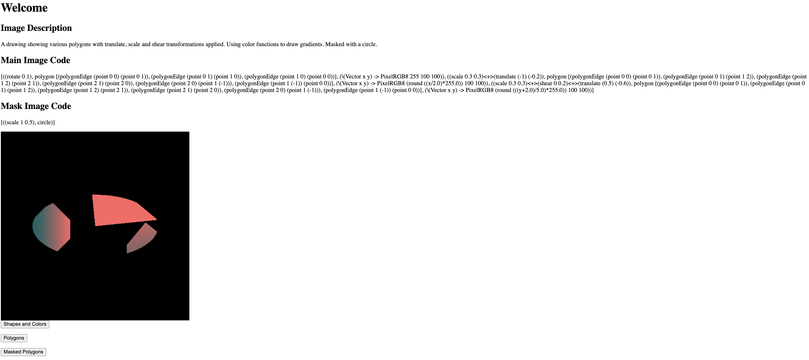

Assignment 1 project for CSU44012-202324 TOPICS IN FUNCTIONAL PROGRAMMING in Trinity College Dublin

I created a Haskell project that provides both a DSL (Domain Specific Language) allowing users to define drawings composed of shapes and transformations along with a Scotty web frontend that renders a variety of predefined programs in my DSL.

**1. Drawing eDSL**

I designed an eDSL by extending the shapes example given to us. The eDSL
provides 5 shapes (Circle, Square, Rectangle, Ellipse and Polygon) along
with 6 affine transformations (Identity, Translate, Scale, Shear and
Rotate).

Shapes are coloured by providing a “colour function”. This function has
to accept an x and a y coordinate and return an RGB colour value. This
allows you to give a shape a constant colour, a gradient or even a
texture mapping.

Drawings are defined as a list of tuples where each tuple has 3 entries
(The transformations applied to the shape, The shape and the colour
function applied to the shape).

Finally the render function takes in two drawings. The main drawing to
be rendered and also a mask drawing (Which follows the same format but
is missing colour functions). Parts of the main drawing are only
rendered if they overlap with a shape in the mask drawing. For example
the following code:

shapesAndColors = \[((scale 0.5 0.25)\<+\>(translate 0.25 0.25), circle,
(\\Vector x y) -\> PixelRGB8 255 255 255))\]

circleMask = \[((scale 1 0.5), circle)\]

render defaultWindow exampleDrawing (MaskDrawing circleMask)

Will draw an image with a circle that has been scaled and translates,
Coloured with a solid white color, Masked with another circle centered
at the origin and scaled.

**2. UI**

The UI is written in Scotty and Blaze. It is relatively simple and
renders once of 3 hardcoded images. The default route is “/:imageNum”
where imageNum is the number of the image to be rendered. The function
for this route first extracts the image number and creates a link to
“/image/imageNum”. It then calls 3 other functions to get strings
representing a description of the current image, The eDSL code for the
current image and the eDSL code for the current mask. These are rendered
in 3 paragraphs. An image tag is also rendered with it’s source set to
the image link generated above, When accessed this image route generates
an image on the fly using the image number supplied. This is returned as
a PNG encoded in a bytestring which avoids saving images unnecessarily
to disk. I tried modifying this function to accept image and mask eDSL
code instead, Which would allow a user to supply a custom program
however I ran into problems when trying to convert the eDSL code from a
string. I first attempted to use the “eval” built in function to
evaluate it to Haskell code however this method would be very insecure
and was very hard to get working so I abandoned this idea.

A screenshot of the UI is shown below:

**3. Optimisation**

My optimisation consisted of rewriting the transforms to use matrix
multiplication. In this system each transform is represented by an
augmented 3X3 matrix where the top left 2X2 submatrix is the
transformation matrix and the left 1X2 column is the translation vector.
Each vector is converted to a 3 vector (The last element being a 1)
before being multiplied by the transformation matrix. This system is
efficient as it uses the inbuilt Haskell matrix library to perform
matrix operations. It also means that many transformations can be
combined efficiently simply by multiplying together their matrices. Each
transformation matrix does have to be inverted however as the way
juicyPixels works means that we need to inversely transform each point
rather than transforming the “Shapes” themselves.

**4. Reflection**

Designing the eDSL was interesting but difficult. I kept the format of
the eDSL very similar to the one provided to us in the “Shapes” example.
The main change to the language that I made was allowing the user to
provide a colour function to each shape. A difficult decision here was
whether to define my own format for writing colour functions or to
assume they will be provided as Haskell functions. I went with the
latter as this allows for more flexibility in terms of what can be done,
However as the point of an eDSL is to be used by non-programmers I’m not
sure if this was the best choice.

I also struggled deciding how to implement transformations. Although
matrix transformations are the most efficient I was stuck on how they
would work with the juicyPixels method of giving a color value for a
specific point. Eventually however I realized all I needed to do was to
invert the matrices.

If instead I was producing an SVG I would not have to invert the
matrices and would have to rewrite the insides functions to produces
points on the borders of shapes instead.
